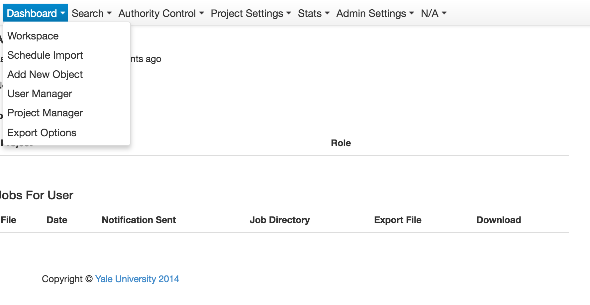

bulk fcrepo import tool
=======================
Java analog of the active C# application [ladybird] (http://ladybird.library.yale.edu/) at Yale University. 
The project began in 2014.

### Installation

System Requirements

1. Java 8

```
mvn clean install
mvn cargo:run
```

The webapp is launched at: http://localhost:8080/bfit-webapp. You should see something like:



### Deployment

The application uses an embedded Tomcat and relational database. The generated .war file should ideally be placed
in a regular servlet container, however. Similarly MySQL should be used as the data store.

### Limitations

The application does not currently publish to Fedora. The project is currently on hold.

### Authors

Lead developer: Osman Din
